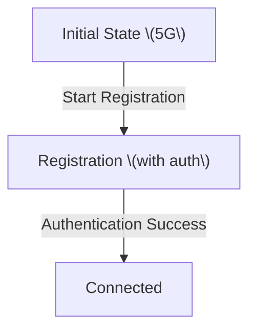

```mermaid
graph TD;
  state1["Initial State \(5G\)"];
  state2["Registration \(with auth\)"];
  state3["Connected"];
  state1 -->|Start Registration| state2;
  state2 -->|Authentication Success| state3;
```
