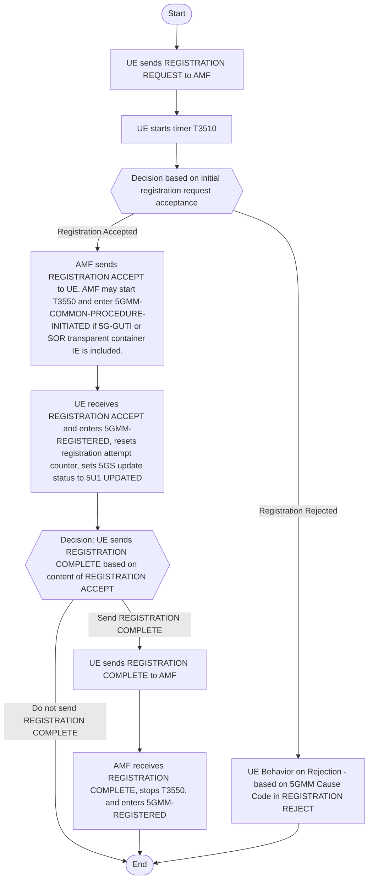

# Registration Procedure Flow

```mermaid
flowchart TD
    start([Start]) --> node1[UE sends REGISTRATION REQUEST to AMF]
    node1[UE sends REGISTRATION REQUEST to AMF] --> node2[UE starts timer T3510]
    node2[UE starts timer T3510] --> node3{{Decision based on initial registration request acceptance}}
    node3{{Decision based on initial registration request acceptance}} -- Registration Accepted --> node4[AMF sends REGISTRATION ACCEPT to UE. AMF may start T3550 and enter 5GMM-COMMON-PROCEDURE-INITIATED if 5G-GUTI or SOR transparent container IE is included.]
    node3{{Decision based on initial registration request acceptance}} -- Registration Rejected --> reject_handling[UE Behavior on Rejection - based on 5GMM Cause Code in REGISTRATION REJECT]
    node4[AMF sends REGISTRATION ACCEPT to UE. AMF may start T3550 and enter 5GMM-COMMON-PROCEDURE-INITIATED if 5G-GUTI or SOR transparent container IE is included.] --> node5[UE receives REGISTRATION ACCEPT and enters 5GMM-REGISTERED, resets registration attempt counter, sets 5GS update status to 5U1 UPDATED]
    node5[UE receives REGISTRATION ACCEPT and enters 5GMM-REGISTERED, resets registration attempt counter, sets 5GS update status to 5U1 UPDATED] --> node6{{Decision: UE sends REGISTRATION COMPLETE based on content of REGISTRATION ACCEPT}}
    node6{{Decision: UE sends REGISTRATION COMPLETE based on content of REGISTRATION ACCEPT}} -- Send REGISTRATION COMPLETE --> node7[UE sends REGISTRATION COMPLETE to AMF]
    node6{{Decision: UE sends REGISTRATION COMPLETE based on content of REGISTRATION ACCEPT}} -- Do not send REGISTRATION COMPLETE --> finish([End])
    node7[UE sends REGISTRATION COMPLETE to AMF] --> node8[AMF receives REGISTRATION COMPLETE, stops T3550, and enters 5GMM-REGISTERED]
    node8[AMF receives REGISTRATION COMPLETE, stops T3550, and enters 5GMM-REGISTERED] --> finish([End])
    reject_handling[UE Behavior on Rejection - based on 5GMM Cause Code in REGISTRATION REJECT] --> finish([End])
```
