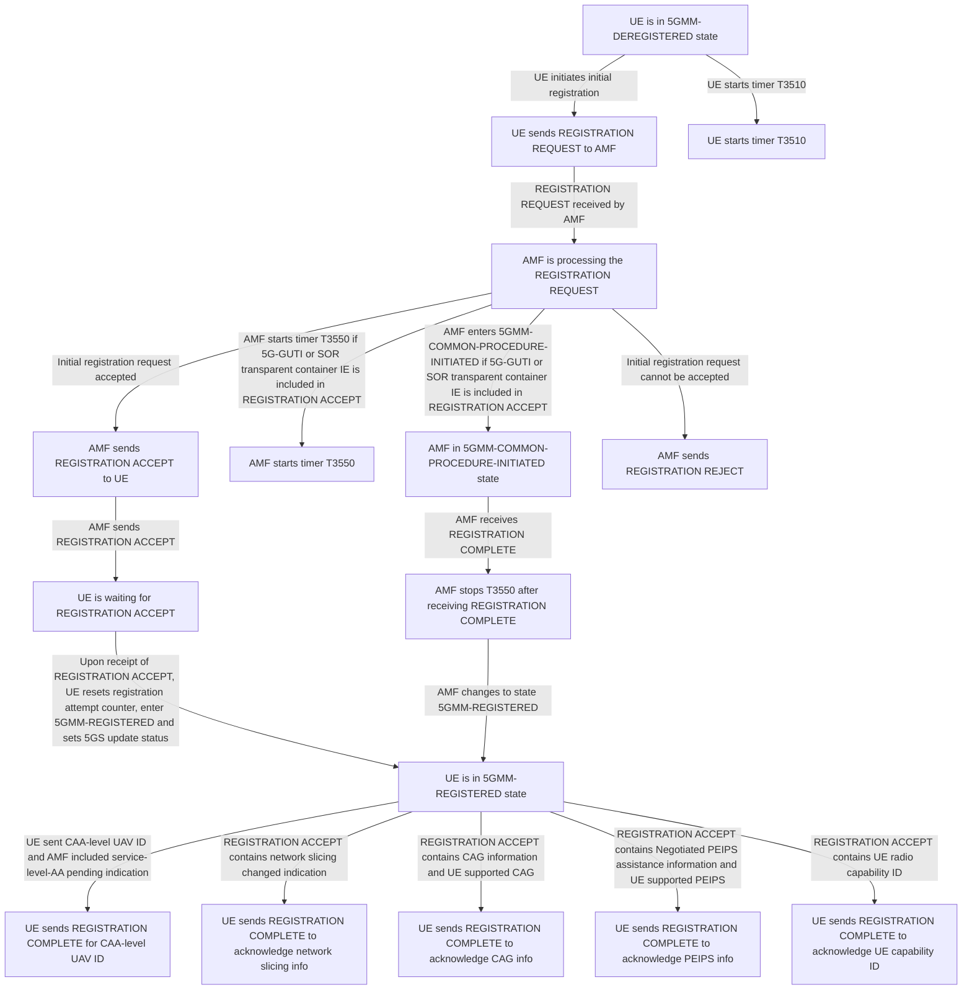

```mermaid
graph TD;
  5GMM-DEREGISTERED["UE is in 5GMM-DEREGISTERED state"];
  REGISTRATION_REQUEST_SENT["UE sends REGISTRATION REQUEST to AMF"];
  T3510_STARTED["UE starts timer T3510"];
  AMF_PROCESSING_REG_REQ["AMF is processing the REGISTRATION REQUEST"];
  REGISTRATION_ACCEPTED["AMF sends REGISTRATION ACCEPT to UE"];
  T3550_STARTED["AMF starts timer T3550"];
  5GMM_COMMON_PROC_INITIATED["AMF in 5GMM-COMMON-PROCEDURE-INITIATED state"];
  UE_WAITING_REG_ACCEPT["UE is waiting for REGISTRATION ACCEPT"];
  5GMM_REGISTERED["UE is in 5GMM-REGISTERED state"];
  REGISTRATION_COMPLETE_SENT_CAA["UE sends REGISTRATION COMPLETE for CAA-level UAV ID"];
  REGISTRATION_COMPLETE_SENT_SLICING["UE sends REGISTRATION COMPLETE to acknowledge network slicing info"];
  REGISTRATION_COMPLETE_SENT_CAG["UE sends REGISTRATION COMPLETE to acknowledge CAG info"];
  REGISTRATION_COMPLETE_SENT_PEIPS["UE sends REGISTRATION COMPLETE to acknowledge PEIPS info"];
  REGISTRATION_COMPLETE_SENT_UE_CAPABILITY_ID["UE sends REGISTRATION COMPLETE to acknowledge UE capability ID"];
  T3550_STOPPED["AMF stops T3550 after receiving REGISTRATION COMPLETE"];
  REGISTRATION_REJECTED["AMF sends REGISTRATION REJECT"];
  5GMM-DEREGISTERED -->|UE initiates initial registration| REGISTRATION_REQUEST_SENT;
  5GMM-DEREGISTERED -->|UE starts timer T3510| T3510_STARTED;
  REGISTRATION_REQUEST_SENT -->|REGISTRATION REQUEST received by AMF| AMF_PROCESSING_REG_REQ;
  AMF_PROCESSING_REG_REQ -->|Initial registration request accepted| REGISTRATION_ACCEPTED;
  AMF_PROCESSING_REG_REQ -->|Initial registration request cannot be accepted| REGISTRATION_REJECTED;
  AMF_PROCESSING_REG_REQ -->|AMF starts timer T3550 if 5G-GUTI or SOR transparent container IE is included in REGISTRATION ACCEPT| T3550_STARTED;
  AMF_PROCESSING_REG_REQ -->|AMF enters 5GMM-COMMON-PROCEDURE-INITIATED if 5G-GUTI or SOR transparent container IE is included in REGISTRATION ACCEPT| 5GMM_COMMON_PROC_INITIATED;
  UE_WAITING_REG_ACCEPT -->|Upon receipt of REGISTRATION ACCEPT, UE resets registration attempt counter, enter 5GMM-REGISTERED and sets 5GS update status| 5GMM_REGISTERED;
  REGISTRATION_ACCEPTED -->|AMF sends REGISTRATION ACCEPT| UE_WAITING_REG_ACCEPT;
  5GMM_REGISTERED -->|UE sent CAA-level UAV ID and AMF included service-level-AA pending indication| REGISTRATION_COMPLETE_SENT_CAA;
  5GMM_REGISTERED -->|REGISTRATION ACCEPT contains network slicing changed indication| REGISTRATION_COMPLETE_SENT_SLICING;
  5GMM_REGISTERED -->|REGISTRATION ACCEPT contains CAG information and UE supported CAG| REGISTRATION_COMPLETE_SENT_CAG;
  5GMM_REGISTERED -->|REGISTRATION ACCEPT contains Negotiated PEIPS assistance information and UE supported PEIPS| REGISTRATION_COMPLETE_SENT_PEIPS;
  5GMM_REGISTERED -->|REGISTRATION ACCEPT contains UE radio capability ID| REGISTRATION_COMPLETE_SENT_UE_CAPABILITY_ID;
  5GMM_COMMON_PROC_INITIATED -->|AMF receives REGISTRATION COMPLETE| T3550_STOPPED;
  T3550_STOPPED -->|AMF changes to state 5GMM-REGISTERED| 5GMM_REGISTERED;
```
