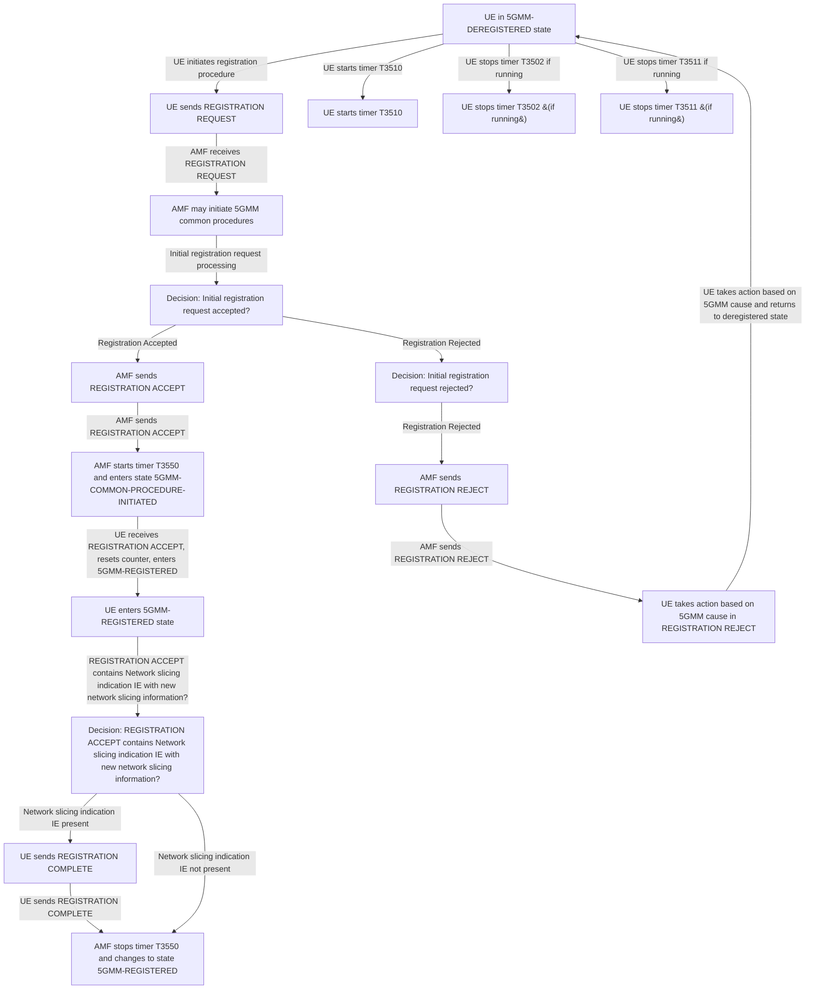

```mermaid
graph TD;
  state_deregistered["UE in 5GMM-DEREGISTERED state"];
  event_reg_req_sent["UE sends REGISTRATION REQUEST"];
  timer_t3510_start["UE starts timer T3510"];
  timer_t3502_stop["UE stops timer T3502 &#40;if running&#41;"];
  timer_t3511_stop["UE stops timer T3511 &#40;if running&#41;"];
  state_common_proc["AMF may initiate 5GMM common procedures"];
  decision_reg_accepted["Decision: Initial registration request accepted?"];
  event_reg_accept_sent["AMF sends REGISTRATION ACCEPT"];
  timer_t3550_start["AMF starts timer T3550 and enters state 5GMM-COMMON-PROCEDURE-INITIATED"];
  state_registered["UE enters 5GMM-REGISTERED state"];
  decision_net_slice_ind["Decision: REGISTRATION ACCEPT contains Network slicing indication IE with new network slicing information?"];
  event_reg_complete_sent["UE sends REGISTRATION COMPLETE"];
  timer_t3550_stop["AMF stops timer T3550 and changes to state 5GMM-REGISTERED"];
  decision_reg_rejected["Decision: Initial registration request rejected?"];
  event_reg_reject_sent["AMF sends REGISTRATION REJECT"];
  state_ue_reject_action["UE takes action based on 5GMM cause in REGISTRATION REJECT"];
  state_deregistered -->|UE initiates registration procedure| event_reg_req_sent;
  state_deregistered -->|UE starts timer T3510| timer_t3510_start;
  state_deregistered -->|UE stops timer T3502 if running| timer_t3502_stop;
  state_deregistered -->|UE stops timer T3511 if running| timer_t3511_stop;
  event_reg_req_sent -->|AMF receives REGISTRATION REQUEST| state_common_proc;
  state_common_proc -->|Initial registration request processing| decision_reg_accepted;
  decision_reg_accepted -->|Registration Accepted| event_reg_accept_sent;
  decision_reg_accepted -->|Registration Rejected| decision_reg_rejected;
  event_reg_accept_sent -->|AMF sends REGISTRATION ACCEPT| timer_t3550_start;
  timer_t3550_start -->|UE receives REGISTRATION ACCEPT, resets counter, enters 5GMM-REGISTERED| state_registered;
  state_registered -->|REGISTRATION ACCEPT contains Network slicing indication IE with new network slicing information?| decision_net_slice_ind;
  decision_net_slice_ind -->|Network slicing indication IE present| event_reg_complete_sent;
  event_reg_complete_sent -->|UE sends REGISTRATION COMPLETE| timer_t3550_stop;
  decision_net_slice_ind -->|Network slicing indication IE not present| timer_t3550_stop;
  decision_reg_rejected -->|Registration Rejected| event_reg_reject_sent;
  event_reg_reject_sent -->|AMF sends REGISTRATION REJECT| state_ue_reject_action;
  state_ue_reject_action -->|UE takes action based on 5GMM cause and returns to deregistered state| state_deregistered;
```
