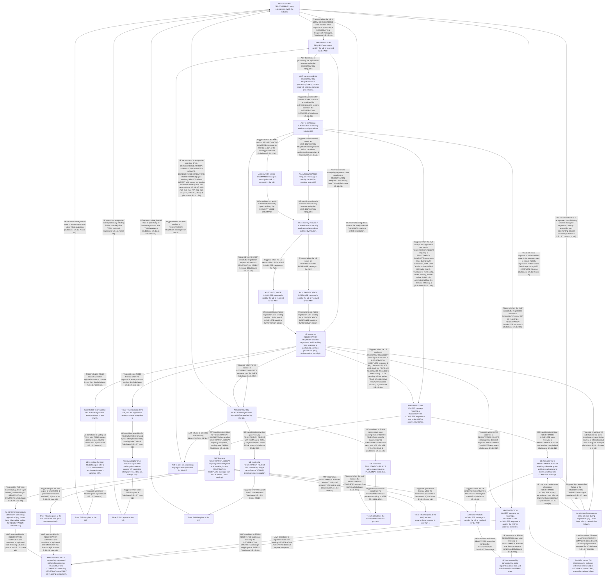

```mermaid
graph TD;
  UE_Deregistered["UE is in 5GMM-DEREGISTERED state, not registered with the network."];
  UE_Attempting_Initial_Registration["UE has sent a REGISTRATION REQUEST for initial registration and is waiting for a response or performing common procedures \(e.g., authentication, security\)."];
  UE_Authenticating_Securing["UE is actively involved in authentication or security mode control procedures initiated by the AMF."];
  UE_Sending_RegComplete["UE has received a REGISTRATION ACCEPT requiring acknowledgment and is preparing to send the REGISTRATION COMPLETE message."];
  UE_Registered["UE has successfully completed the initial registration procedure and is in 5GMM-REGISTERED state."];
  UE_Retry_After_Rejection["UE received a REGISTRATION REJECT with a cause requiring a backoff period \(T3346\) before retrying registration."];
  UE_Deregistered_PLMN_Search["UE received a REGISTRATION REJECT with a cause requiring PLMN/SNPN reselection."];
  UE_Waiting_T3511["UE is waiting for timer T3511 to expire after a T3510 timeout before retrying registration \(attempt < 5\)."];
  UE_Waiting_T3502["UE is waiting for timer T3502 to expire after reaching the maximum number of registration attempts \(T3510 timeout, attempt = 5\)."];
  AMF_Idle["AMF is idle, not processing any registration procedure for this UE."];
  AMF_Processing_Initial_Registration["AMF has received the REGISTRATION REQUEST and is processing it \(e.g., context retrieval, initiating common procedures\)."];
  AMF_Authenticating_Securing["AMF is performing authentication or security mode control procedures with the UE."];
  AMF_Waiting_Registration_Complete["AMF has sent REGISTRATION ACCEPT requiring acknowledgment and is waiting for the REGISTRATION COMPLETE message from the UE \(timer T3550 running\)."];
  AMF_Registered["AMF considers the UE successfully registered \(either after receiving REGISTRATION COMPLETE or sending REGISTRATION ACCEPT not requiring completion\)."];
  E_REGISTRATION_REQUEST["A REGISTRATION REQUEST message is sent by the UE or received by the AMF."];
  E_AUTHENTICATION_REQUEST["An AUTHENTICATION REQUEST message is sent by the AMF or received by the UE."];
  E_SECURITY_MODE_COMMAND["A SECURITY MODE COMMAND message is sent by the AMF or received by the UE."];
  E_AUTHENTICATION_RESPONSE["An AUTHENTICATION RESPONSE message is sent by the UE or received by the AMF."];
  E_SECURITY_MODE_COMPLETE["A SECURITY MODE COMPLETE message is sent by the UE or received by the AMF."];
  E_REGISTRATION_ACCEPT_ReqComplete["A REGISTRATION ACCEPT message requiring a REGISTRATION COMPLETE response is sent by the AMF or received by the UE."];
  E_REGISTRATION_ACCEPT_NoComplete["A REGISTRATION ACCEPT message not requiring a REGISTRATION COMPLETE response is sent by the AMF or received by the UE."];
  E_REGISTRATION_REJECT["A REGISTRATION REJECT message is sent by the AMF or received by the UE."];
  E_REGISTRATION_COMPLETE["A REGISTRATION COMPLETE message is sent by the UE or received by the AMF."];
  E_T3510_Timeout_Retry["Timer T3510 expires at the UE, and the registration attempt counter is less than 5."];
  E_T3510_Timeout_Max["Timer T3510 expires at the UE, and the registration attempt counter is equal to 5."];
  E_T3511_Timeout["Timer T3511 expires at the UE."];
  E_T3502_Timeout["Timer T3502 expires at the UE."];
  E_T3346_Timeout["Timer T3346 expires at the UE."];
  E_PLMN_Selection_Complete["The UE completes the PLMN/SNPN selection process."];
  E_T3550_Timeout_Retry["Timer T3550 expires at the AMF, and the retransmission counter is less than 4."];
  E_T3550_Timeout_Max["Timer T3550 expires at the AMF for the fifth time \(max retransmissions\)."];
  E_Failure_UE["An abnormal case occurs at the UE side during registration \(e.g., lower layer failure, transmission failure\)."];
  E_TAI_Changed["The UE's current TAI changes and is no longer in the TAI list received in REGISTRATION ACCEPT, potentially during a failure."];
  E_Failure_AMF["An abnormal case occurs at the AMF side during registration \(e.g., lower layer failure while waiting for REGISTRATION COMPLETE\)."];
  UE_Deregistered -->|Triggered when the UE in 5GMM-DEREGISTERED state initiates initial registration by sending a REGISTRATION REQUEST message &#40;Subclause 5.5.1.2.2&#41;.| E_REGISTRATION_REQUEST;
  E_REGISTRATION_REQUEST -->|UE transitions to attempting registration after sending the REGISTRATION REQUEST and starting timer T3510 &#40;Subclause 5.5.1.2.2&#41;.| UE_Attempting_Initial_Registration;
  AMF_Idle -->|Triggered when the AMF receives a REGISTRATION REQUEST message from the UE.| E_REGISTRATION_REQUEST;
  E_REGISTRATION_REQUEST -->|AMF transitions to processing the registration upon receiving the REGISTRATION REQUEST.| AMF_Processing_Initial_Registration;
  AMF_Processing_Initial_Registration -->|Triggered when the AMF initiates 5GMM common procedures like authentication and security based on the REGISTRATION REQUEST &#40;Subclause 5.5.1.2.3&#41;.| AMF_Authenticating_Securing;
  AMF_Authenticating_Securing -->|Triggered when the AMF sends an AUTHENTICATION REQUEST message to the UE as part of the authentication procedure &#40;Subclause 5.5.1.2.3&#41;.| E_AUTHENTICATION_REQUEST;
  E_AUTHENTICATION_REQUEST -->|UE transitions to handle authentication/security upon receiving the AUTHENTICATION REQUEST.| UE_Authenticating_Securing;
  AMF_Authenticating_Securing -->|Triggered when the AMF sends a SECURITY MODE COMMAND message to the UE as part of the security procedure &#40;Subclause 5.5.1.2.3&#41;.| E_SECURITY_MODE_COMMAND;
  E_SECURITY_MODE_COMMAND -->|UE transitions to handle authentication/security upon receiving the SECURITY MODE COMMAND.| UE_Authenticating_Securing;
  UE_Authenticating_Securing -->|Triggered when the UE sends an AUTHENTICATION RESPONSE message to the AMF.| E_AUTHENTICATION_RESPONSE;
  E_AUTHENTICATION_RESPONSE -->|UE returns to attempting registration after sending the AUTHENTICATION RESPONSE, awaiting further network action.| UE_Attempting_Initial_Registration;
  UE_Authenticating_Securing -->|Triggered when the UE sends a SECURITY MODE COMPLETE message to the AMF.| E_SECURITY_MODE_COMPLETE;
  E_SECURITY_MODE_COMPLETE -->|UE returns to attempting registration after sending the SECURITY MODE COMPLETE, awaiting further network action.| UE_Attempting_Initial_Registration;
  AMF_Authenticating_Securing -->|Triggered when the AMF accepts the registration and sends REGISTRATION ACCEPT requiring a REGISTRATION COMPLETE response &#40;e.g., due to GUTI reallocation, SOR, ODB, CAG list update, PEIPS, UE Radio Cap ID, Truncated S-TMSI config, UUAA pending, NSSAI update, NSAG info, Alternative NSSAI, On-demand NSSAI&#41; &#40;Subclause 5.5.1.2.4&#41;.| E_REGISTRATION_ACCEPT_ReqComplete;
  E_REGISTRATION_ACCEPT_ReqComplete -->|AMF transitions to waiting for REGISTRATION COMPLETE after sending REGISTRATION ACCEPT requiring completion, starting timer T3550 &#40;Subclause 5.5.1.2.4&#41;.| AMF_Waiting_Registration_Complete;
  AMF_Authenticating_Securing -->|Triggered when the AMF accepts the registration and sends REGISTRATION ACCEPT not requiring a REGISTRATION COMPLETE response &#40;Subclause 5.5.1.2.4&#41;.| E_REGISTRATION_ACCEPT_NoComplete;
  E_REGISTRATION_ACCEPT_NoComplete -->|AMF transitions to registered state after sending REGISTRATION ACCEPT that does not require completion.| AMF_Registered;
  AMF_Authenticating_Securing -->|Triggered when the AMF rejects the registration request and sends a REGISTRATION REJECT message &#40;Subclause 5.5.1.2.5&#41;.| E_REGISTRATION_REJECT;
  E_REGISTRATION_REJECT -->|AMF returns to idle state after sending REGISTRATION REJECT.| AMF_Idle;
  UE_Attempting_Initial_Registration -->|Triggered when the UE receives a REGISTRATION ACCEPT message that requires a REGISTRATION COMPLETE response &#40;e.g., due to GUTI, SOR, ODB, CAG list, PEIPS, UE Radio Cap ID, Truncated S-TMSI config, UUAA pending, NSSAI update, NSAG info, Alternative NSSAI, On-demand NSSAI&#41; &#40;Subclause 5.5.1.2.4&#41;.| E_REGISTRATION_ACCEPT_ReqComplete;
  E_REGISTRATION_ACCEPT_ReqComplete -->|UE transitions to sending REGISTRATION COMPLETE upon receiving a REGISTRATION ACCEPT that requires completion &#40;Subclause 5.5.1.2.4&#41;.| UE_Sending_RegComplete;
  UE_Attempting_Initial_Registration -->|Triggered when the UE receives a REGISTRATION ACCEPT message that does not require a REGISTRATION COMPLETE response &#40;Subclause 5.5.1.2.4&#41;.| E_REGISTRATION_ACCEPT_NoComplete;
  E_REGISTRATION_ACCEPT_NoComplete -->|UE transitions to 5GMM-REGISTERED state upon receiving a REGISTRATION ACCEPT that does not require completion &#40;Subclause 5.5.1.2.4&#41;.| UE_Registered;
  UE_Attempting_Initial_Registration -->|Triggered when the UE receives a REGISTRATION REJECT message from the AMF &#40;Subclause 5.5.1.2.5&#41;.| E_REGISTRATION_REJECT;
  E_REGISTRATION_REJECT -->|UE transitions to retry state upon receiving REGISTRATION REJECT with 5GMM cause #22 &#40;Congestion&#41; and a valid T3346 value &#40;Subclause 5.5.1.2.5&#41;.| UE_Retry_After_Rejection;
  E_REGISTRATION_REJECT -->|UE transitions to PLMN search state upon receiving REGISTRATION REJECT with specific causes requiring PLMN/SNPN reselection &#40;e.g., #11, #73, #74, #75, #76, #78, #80&#41; &#40;Subclause 5.5.1.2.5&#41;.| UE_Deregistered_PLMN_Search;
  E_REGISTRATION_REJECT -->|UE transitions to a deregistered sub-state &#40;e.g., DEREGISTERED.NO-SUPI, DEREGISTERED.LIMITED-SERVICE, DEREGISTERED.ATTEMPTING-REGISTRATION&#41; upon receiving REGISTRATION REJECT with causes not leading to immediate retry or PLMN search &#40;e.g., #3, #6, #7, #10, #12, #13, #15, #27, #31, #62, #72, #77, #79, #81, #82&#41; &#40;Subclause 5.5.1.2.5&#41;.| UE_Deregistered;
  UE_Retry_After_Rejection -->|Triggered when the backoff timer T3346 expires &#40;Subclause 5.5.1.2.5, Cause #22&#41;.| E_T3346_Timeout;
  E_T3346_Timeout -->|UE returns to deregistered state to potentially re-initiate registration after T3346 expires &#40;Subclause 5.5.1.2.5, Cause #22&#41;.| UE_Deregistered;
  UE_Deregistered_PLMN_Search -->|Triggered when the UE completes the PLMN/SNPN selection process according to 3GPP TS 23.122 &#91;5&#93;.| E_PLMN_Selection_Complete;
  E_PLMN_Selection_Complete -->|UE returns to deregistered state on the newly selected PLMN/SNPN, ready to initiate registration.| UE_Deregistered;
  UE_Sending_RegComplete -->|Triggered when the UE sends the REGISTRATION COMPLETE message to the AMF &#40;Subclause 5.5.1.2.4&#41;.| E_REGISTRATION_COMPLETE;
  E_REGISTRATION_COMPLETE -->|UE transitions to 5GMM-REGISTERED state after sending the REGISTRATION COMPLETE message.| UE_Registered;
  AMF_Waiting_Registration_Complete -->|Triggered when the AMF receives the REGISTRATION COMPLETE message from the UE &#40;Subclause 5.5.1.2.4&#41;.| E_REGISTRATION_COMPLETE;
  E_REGISTRATION_COMPLETE -->|AMF transitions to 5GMM-REGISTERED state upon receiving the REGISTRATION COMPLETE message, stopping timer T3550 &#40;Subclause 5.5.1.2.4&#41;.| AMF_Registered;
  UE_Attempting_Initial_Registration -->|Triggered upon T3510 timeout when the registration attempt counter is less than 5 &#40;Subclause 5.5.1.2.7 case c&#41;.| E_T3510_Timeout_Retry;
  E_T3510_Timeout_Retry -->|UE transitions to waiting for T3511 after T3510 timeout &#40;retry case&#41;, starting timer T3511 &#40;Subclause 5.5.1.2.7 case c&#41;.| UE_Waiting_T3511;
  UE_Waiting_T3511 -->|Triggered when timer T3511 expires &#40;Subclause 5.5.1.2.7 case c&#41;.| E_T3511_Timeout;
  E_T3511_Timeout -->|UE returns to deregistered state to restart registration after T3511 expires &#40;Subclause 5.5.1.2.7 case c&#41;.| UE_Deregistered;
  UE_Attempting_Initial_Registration -->|Triggered upon T3510 timeout when the registration attempt counter reaches 5 &#40;Subclause 5.5.1.2.7 case c&#41;.| E_T3510_Timeout_Max;
  E_T3510_Timeout_Max -->|UE transitions to waiting for T3502 after T3510 timeout &#40;max attempts reached&#41;, starting timer T3502 &#40;Subclause 5.5.1.2.7 case c&#41;.| UE_Waiting_T3502;
  UE_Waiting_T3502 -->|Triggered when timer T3502 expires &#40;Subclause 5.5.1.2.7 case c&#41;.| E_T3502_Timeout;
  E_T3502_Timeout -->|UE returns to deregistered state &#40;potentially initiating PLMN search&#41; after T3502 expires &#40;Subclause 5.5.1.2.7 case c&#41;.| UE_Deregistered;
  UE_Attempting_Initial_Registration -->|Triggered by various UE-side failures like lower layer issues, transmission failures, or other abnormal cases during the attempt &#40;Subclause 5.5.1.2.7 cases e, k, n&#41;.| E_Failure_UE;
  E_Failure_UE -->|UE transitions back to a deregistered state following a failure during the registration attempt, potentially after incrementing attempt counter &#40;Subclause 5.5.1.2.7 cases c, d, e&#41;.| UE_Deregistered;
  UE_Sending_RegComplete -->|Triggered by transmission failure of the REGISTRATION COMPLETE message &#40;Subclause 5.5.1.2.7 case j&#41;.| E_Failure_UE;
  E_Failure_UE -->|UE may return to the state of sending REGISTRATION COMPLETE to retry transmission after failure &#40;implementation specific&#41; &#40;Subclause 5.5.1.2.7 case j&#41;.| UE_Sending_RegComplete;
  E_Failure_UE -->|Condition where failure to send REGISTRATION COMPLETE coincides with TAI changing out of the assigned list &#40;Subclause 5.5.1.2.7 case i&#41;.| E_TAI_Changed;
  E_TAI_Changed -->|UE aborts initial registration and transitions towards deregistered state to initiate mobility registration update due to TAI change during REG COMPLETE failure &#40;Subclause 5.5.1.2.7 case i&#41;.| UE_Deregistered;
  AMF_Waiting_Registration_Complete -->|Triggered upon T3550 timeout when the retransmission counter is less than 4 &#40;Subclause 5.5.1.2.8 case c&#41;.| E_T3550_Timeout_Retry;
  E_T3550_Timeout_Retry -->|AMF retransmits REGISTRATION ACCEPT, restarts T3550, and remains in the waiting state &#40;Subclause 5.5.1.2.8 case c&#41;.| AMF_Waiting_Registration_Complete;
  AMF_Waiting_Registration_Complete -->|Triggered upon the fifth expiry of timer T3550 &#40;max retransmissions reached&#41; &#40;Subclause 5.5.1.2.8 case c&#41;.| E_T3550_Timeout_Max;
  E_T3550_Timeout_Max -->|AMF aborts waiting for REGISTRATION COMPLETE and transitions to registered state after T3550 max timeouts &#40;Subclause 5.5.1.2.8 case c&#41;.| AMF_Registered;
  AMF_Waiting_Registration_Complete -->|Triggered by AMF-side failures &#40;e.g., lower layer failure&#41; while waiting for REGISTRATION COMPLETE &#40;Subclause 5.5.1.2.8 case a&#41;.| E_Failure_AMF;
  E_Failure_AMF -->|AMF aborts waiting for REGISTRATION COMPLETE and transitions to registered state following a failure &#40;Subclause 5.5.1.2.8 case a&#41;.| AMF_Registered;
```
