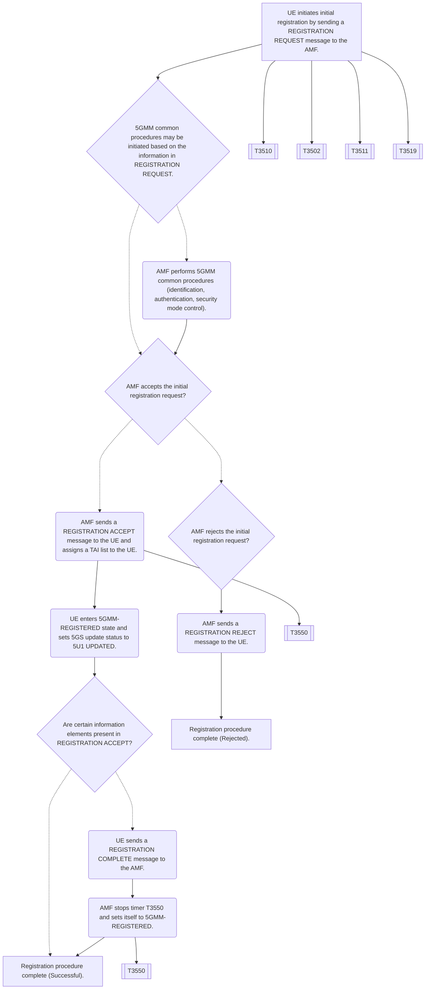

```mermaid
flowchart TD
    1["UE initiates initial registration by sending a REGISTRATION REQUEST message to the AMF."]
    2{"5GMM common procedures may be initiated based on the information in REGISTRATION REQUEST."}
    3("AMF performs 5GMM common procedures (identification, authentication, security mode control).")
    4{"AMF accepts the initial registration request?"}
    5("AMF sends a REGISTRATION ACCEPT message to the UE and assigns a TAI list to the UE.")
    6("UE enters 5GMM-REGISTERED state and sets 5GS update status to 5U1 UPDATED.")
    7{"Are certain information elements present in REGISTRATION ACCEPT?"}
    8("UE sends a REGISTRATION COMPLETE message to the AMF.")
    9("AMF stops timer T3550 and sets itself to 5GMM-REGISTERED.")
    10{"AMF rejects the initial registration request?"}
    11("AMF sends a REGISTRATION REJECT message to the UE.")
    12["Registration procedure complete (Successful)."]
    13["Registration procedure complete (Rejected)."]
    14[["T3550"]]
    15[["T3550"]]
    16[["T3510"]]
    17[["T3502"]]
    18[["T3511"]]
    19[["T3519"]]
    1 --> 2
    2 -..-> 3
    2 -..-> 4
    3 --> 4
    4 -..-> 5
    4 -..-> 10
    5 --> 6
    6 --> 7
    7 -..-> 8
    7 -..-> 12
    8 --> 9
    9 --> 12
    10 --> 11
    11 --> 13
    5 --> 14
    9 --> 15
    1 --> 16
    1 --> 17
    1 --> 18
    1 --> 19
```