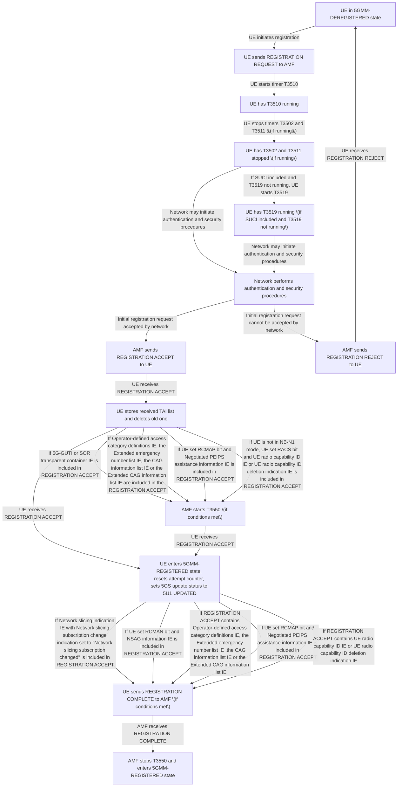

```mermaid
graph TD;
  state_deregistered["UE in 5GMM-DEREGISTERED state"];
  event_reg_req["UE sends REGISTRATION REQUEST to AMF"];
  state_t3510_running["UE has T3510 running"];
  state_timers_stopped["UE has T3502 and T3511 stopped \(if running\)"];
  state_t3519_running["UE has T3519 running \(if SUCI included and T3519 not running\)"];
  event_auth_sec["Network performs authentication and security procedures"];
  event_reg_accept["AMF sends REGISTRATION ACCEPT to UE"];
  state_tai_list_stored["UE stores received TAI list and deletes old one"];
  state_amf_timer_started["AMF starts T3550 \(if conditions met\)"];
  state_registered["UE enters 5GMM-REGISTERED state, resets attempt counter, sets 5GS update status to 5U1 UPDATED"];
  event_reg_complete["UE sends REGISTRATION COMPLETE to AMF \(if conditions met\)"];
  state_amf_registered["AMF stops T3550 and enters 5GMM-REGISTERED state"];
  event_reg_reject["AMF sends REGISTRATION REJECT to UE"];
  state_deregistered -->|UE initiates registration| event_reg_req;
  event_reg_req -->|UE starts timer T3510| state_t3510_running;
  state_t3510_running -->|UE stops timers T3502 and T3511 &#40;if running&#41;| state_timers_stopped;
  state_timers_stopped -->|If SUCI included and T3519 not running, UE starts T3519| state_t3519_running;
  state_timers_stopped -->|Network may initiate authentication and security procedures| event_auth_sec;
  state_t3519_running -->|Network may initiate authentication and security procedures| event_auth_sec;
  event_auth_sec -->|Initial registration request accepted by network| event_reg_accept;
  event_auth_sec -->|Initial registration request cannot be accepted by network| event_reg_reject;
  event_reg_accept -->|UE receives REGISTRATION ACCEPT| state_tai_list_stored;
  state_tai_list_stored -->|If 5G-GUTI or SOR transparent container IE is included in REGISTRATION ACCEPT| state_amf_timer_started;
  state_tai_list_stored -->|If Operator-defined access category definitions IE, the Extended emergency number list IE, the CAG information list IE or the Extended CAG information list IE are included in the REGISTRATION ACCEPT| state_amf_timer_started;
  state_tai_list_stored -->|If UE set RCMAP bit and Negotiated PEIPS assistance information IE is included in REGISTRATION ACCEPT| state_amf_timer_started;
  state_tai_list_stored -->|If UE is not in NB-N1 mode, UE set RACS bit and UE radio capability ID IE or UE radio capability ID deletion indication IE is included in REGISTRATION ACCEPT| state_amf_timer_started;
  state_tai_list_stored -->|UE receives REGISTRATION ACCEPT| state_registered;
  state_amf_timer_started -->|UE receives REGISTRATION ACCEPT| state_registered;
  state_registered -->|If Network slicing indication IE with Network slicing subscription change indication set to &quot;Network slicing subscription changed&quot; is included in REGISTRATION ACCEPT| event_reg_complete;
  state_registered -->|If UE set RCMAN bit and NSAG information IE is included in REGISTRATION ACCEPT| event_reg_complete;
  state_registered -->|If REGISTRATION ACCEPT contains Operator-defined access category definitions IE, the Extended emergency number list IE ,the CAG information list IE or the Extended CAG information list IE| event_reg_complete;
  state_registered -->|If UE set RCMAP bit and Negotiated PEIPS assistance information IE is included in REGISTRATION ACCEPT| event_reg_complete;
  state_registered -->|If REGISTRATION ACCEPT contains UE radio capability ID IE or UE radio capability ID deletion indication IE| event_reg_complete;
  event_reg_complete -->|AMF receives REGISTRATION COMPLETE| state_amf_registered;
  event_reg_reject -->|UE receives REGISTRATION REJECT| state_deregistered;
```
