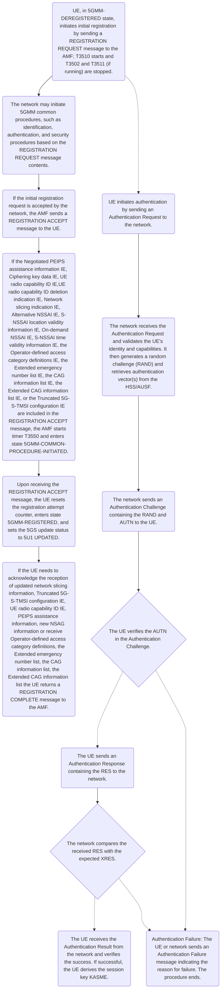

```mermaid
flowchart TD
    1("UE, in 5GMM-DEREGISTERED state, initiates initial registration by sending a REGISTRATION REQUEST message to the AMF; T3510 starts and T3502 and T3511 (if running) are stopped.")
    2("The network may initiate 5GMM common procedures, such as identification, authentication, and security procedures based on the REGISTRATION REQUEST message contents.")
    3("If the initial registration request is accepted by the network, the AMF sends a REGISTRATION ACCEPT message to the UE.")
    4("If the Negotiated PEIPS assistance information IE, Ciphering key data IE, UE radio capability ID IE,UE radio capability ID deletion indication IE, Network slicing indication IE, Alternative NSSAI IE, S-NSSAI location validity information IE, On-demand NSSAI IE, S-NSSAI time validity information IE, the Operator-defined access category definitions IE, the Extended emergency number list IE, the CAG information list IE, the Extended CAG information list IE, or the Truncated 5G-S-TMSI configuration IE are included in the REGISTRATION ACCEPT message, the AMF starts timer T3550 and enters state 5GMM-COMMON-PROCEDURE-INITIATED.")
    5("Upon receiving the REGISTRATION ACCEPT message, the UE resets the registration attempt counter, enters state 5GMM-REGISTERED, and sets the 5GS update status to 5U1 UPDATED.")
    6("If the UE needs to acknowledge the reception of updated network slicing information, Truncated 5G-S-TMSI configuration IE, UE radio capability ID IE, PEIPS assistance information, new NSAG information or receive Operator-defined access category definitions, the Extended emergency number list, the CAG information list, the Extended CAG information list the UE returns a REGISTRATION COMPLETE message to the AMF.")
    7("UE initiates authentication by sending an Authentication Request to the network.")
    8("The network receives the Authentication Request and validates the UE's identity and capabilities. It then generates a random challenge (RAND) and retrieves authentication vector(s) from the HSS/AUSF.")
    9("The network sends an Authentication Challenge containing the RAND and AUTN to the UE.")
    10{"The UE verifies the AUTN in the Authentication Challenge."}
    11("The UE sends an Authentication Response containing the RES to the network.")
    12{"The network compares the received RES with the expected XRES."}
    13("Authentication Failure: The UE or network sends an Authentication Failure message indicating the reason for failure. The procedure ends.")
    14("The UE receives the Authentication Result from the network and verifies the success. If successful, the UE derives the session key KASME.")
    1 --> 2
    2 --> 3
    3 --> 4
    4 --> 5
    5 --> 6
    1 -..-> 7
    7 --> 8
    8 --> 9
    9 --> 10
    10 -..-> 11
    10 -..-> 13
    11 --> 12
    12 -..-> 14
    12 -..-> 13
```