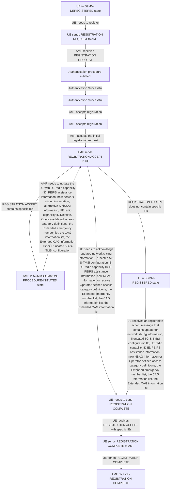

```mermaid
graph TD;
  state_deregistered["UE in 5GMM-DEREGISTERED state"];
  event_reg_req["UE sends REGISTRATION REQUEST to AMF"];
  state_auth_proc["Authentication procedure initiated"];
  event_auth_success["Authentication Successful"];
  state_reg_accepted["AMF accepts registration"];
  event_reg_accept["AMF sends REGISTRATION ACCEPT to UE"];
  state_common_proc_initiated["AMF in 5GMM-COMMON-PROCEDURE-INITIATED state"];
  state_registered["UE in 5GMM-REGISTERED state"];
  event_reg_complete_needed["UE needs to send REGISTRATION COMPLETE"];
  event_reg_complete["UE sends REGISTRATION COMPLETE to AMF"];
  state_reg_complete_received["AMF receives REGISTRATION COMPLETE"];
  state_deregistered -->|UE needs to register| event_reg_req;
  event_reg_req -->|AMF receives REGISTRATION REQUEST| state_auth_proc;
  state_auth_proc -->|Authentication Successful| event_auth_success;
  event_auth_success -->|AMF accepts registration| state_reg_accepted;
  state_reg_accepted -->|AMF accepts the initial registration request| event_reg_accept;
  event_reg_accept -->|REGISTRATION ACCEPT contains specific IEs| state_common_proc_initiated;
  event_reg_accept -->|REGISTRATION ACCEPT does not contain specific IEs| state_registered;
  state_common_proc_initiated -->|AMF needs to update the UE with UE radio capability ID, PEIPS assistance information, new network slicing information, alternative S-NSSAI information, UE radio capability ID Deletion, Operator-defined access category definitions, the Extended emergency number list, the CAG information list, the Extended CAG information list or Truncated 5G-S-TMSI configuration| event_reg_accept;
  event_reg_accept -->|UE needs to acknowledge updated network slicing information, Truncated 5G-S-TMSI configuration IE, UE radio capability ID IE, PEIPS assistance information, new NSAG information or receive Operator-defined access category definitions, the Extended emergency number list, the CAG information list, the Extended CAG information list| event_reg_complete_needed;
  event_reg_complete_needed -->|UE receives REGISTRATION ACCEPT with specific IEs| event_reg_complete;
  event_reg_complete -->|UE sends REGISTRATION COMPLETE| state_reg_complete_received;
  state_registered -->|UE receives an registration accept message that contains update for network slicing information, Truncated 5G-S-TMSI configuration IE, UE radio capability ID IE, PEIPS assistance information, new NSAG information or Operator-defined access category definitions, the Extended emergency number list, the CAG information list, the Extended CAG information list| event_reg_complete_needed;
```
