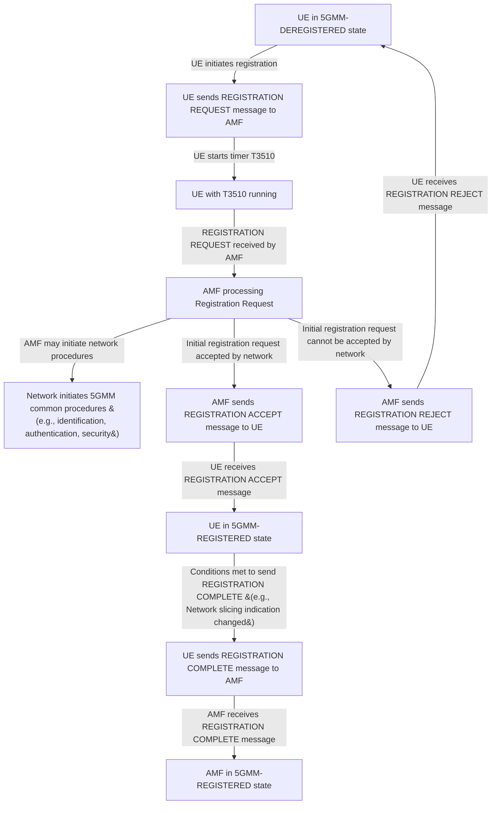

```mermaid
graph TD;
  state_deregistered["UE in 5GMM-DEREGISTERED state"];
  event_reg_req["UE sends REGISTRATION REQUEST message to AMF"];
  state_t3510_running["UE with T3510 running"];
  event_network_procedures["Network initiates 5GMM common procedures &#40;e.g., identification, authentication, security&#41;"];
  state_amf_processing["AMF processing Registration Request"];
  event_reg_accept["AMF sends REGISTRATION ACCEPT message to UE"];
  state_registered["UE in 5GMM-REGISTERED state"];
  event_reg_complete["UE sends REGISTRATION COMPLETE message to AMF"];
  state_amf_registered["AMF in 5GMM-REGISTERED state"];
  event_reg_reject["AMF sends REGISTRATION REJECT message to UE"];
  state_deregistered -->|UE initiates registration| event_reg_req;
  event_reg_req -->|UE starts timer T3510| state_t3510_running;
  state_t3510_running -->|REGISTRATION REQUEST received by AMF| state_amf_processing;
  state_amf_processing -->|AMF may initiate network procedures| event_network_procedures;
  state_amf_processing -->|Initial registration request accepted by network| event_reg_accept;
  state_amf_processing -->|Initial registration request cannot be accepted by network| event_reg_reject;
  event_reg_accept -->|UE receives REGISTRATION ACCEPT message| state_registered;
  state_registered -->|Conditions met to send REGISTRATION COMPLETE &#40;e.g., Network slicing indication changed&#41;| event_reg_complete;
  event_reg_complete -->|AMF receives REGISTRATION COMPLETE message| state_amf_registered;
  event_reg_reject -->|UE receives REGISTRATION REJECT message| state_deregistered;
```
